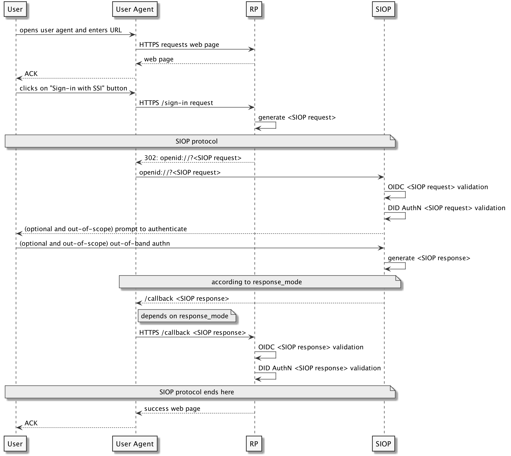

# DID AuthN profile for OpenID Connect

**Editors**

| Author          | Company  |
| ------------- | -------- |
| Oliver Terbu  | uPort/ ConsenSys          |

## 1 Abbreviations
| Short         | Long
| ------------- |--------------------------
| OP            | OpenID Connect Provider
| SIOP          | Self-Issued OP
| RP            | Relying Party/ OIDC Client
| JWE           | JSON Web Encryption
| JWS           | JSON Web Signature
| JWT           | JSON Web Token

## 2 Introduction

An everyday use case that the SSI community identified is the sign-up or login with web applications. Nowadays, this is often achieved through social login schemes such as Google Sign-In. While the SSI community has serious concerns about social login, the underlying protocol, OIDC, does not have these flaws by design. DID AuthN provides great potential by leveraging an SSI wallet, e.g., as a smartphone app, on the web. This will increase and preserve the user’s privacy by preventing third-parties from having the ability to track which web applications a user is interacting with.

This specification defines the SIOP DID AuthN flavor to use OIDC together with the strong decentralization, privacy and security guarantees of DID for everyone who wants to have a generic way to integrate SSI wallets into their web applications.

## 3 Purpose
- Staying backward compatible with existing OIDC clients that implement the SIOP specification which is part of the OIDC core specification.
- Adding validation rules for OIDC clients that have DID AuthN support to make full use of DIDs.

> **TBD:** Some description, e.g., supported architectures, mobile
 device, browser plugin, etc., SIOP to get DID and openid discovery 
 endpoint + CIBA+DID as login_hint for OIDC flow, just login, bootstrap DID Comm,
 interop matrix for plain OIDC/did authn enabled OIDC

## 4 Protocol Flow

> **TBD:** describe high-level protocol flow and refer to sections below.



> **NOTE:** In the diagram above, the "Identity Wallet" represents the SIOP, and the "RP" represents the requesting party.

### Generate <SIOP Request>

#### Redirect Request
The request contains `response_type` and `client_id` as query string parameters for backward compatibility with the OAuth2 specification. `response_type` MUST be
`id_token` and `client_id` MUST specify the callback URL of the RP (as per [SIOP](https://openid.net/specs/openid-connect-core-1_0.html#SelfIssued)). All other OIDC request parameters MUST be provided in an [Request Object](https://openid.net/specs/openid-connect-core-1_0.html#RequestObject) which is encoded as a JWT. This enables the RP to authenticate against the SIOP using the RP's DID. The Base64-URL-encoded [Request Object](https://openid.net/specs/openid-connect-core-1_0.html#RequestObject) can be passed by value in the `request` request parameter, or by reference using the `request_uri` parameter.

The following is a non-normative example of an DID AuthN `<SIOP request>` initiated by the RP using [Request Object](https://openid.net/specs/openid-connect-core-1_0.html#RequestObject) by value:
```
  openid://?response_type=id_token
    &client_id=https%3A%2F%2Frp.example.com%2Fcb
    &request=<JWT>
```

The following is a non-normative example of an DID AuthN `<SIOP request>` initiated by the RP using [Request Object](https://openid.net/specs/openid-connect-core-1_0.html#RequestObject) by reference:
```
  openid://?response_type=id_token
    &client_id=https%3A%2F%2Frp.example.com%2Fcb
    &request_uri=https%3A%2F%2Frp.example.com%2F90ce0b8a-a910-4dd0
```

#### Request Object
The [Request Object](https://openid.net/specs/openid-connect-core-1_0.html#RequestObject) follows the OIDC specification, e.g., adding `nonce`, `state`, `response_type`, and `client_id` parameters.

This specification introduces additional constraints for request parameters:
- `iss` MUST contain the DID of the RP that can be resolved to a DID Document containing the verification key of the [Request Object](https://openid.net/specs/openid-connect-core-1_0.html#RequestObject).

> **NOTE:** By default, the `iss` attribute of the [Request Object](https://openid.net/specs/openid-connect-core-1_0.html#RequestObject) refers to the `client_id` but SIOP assumes that `client_id` is the callback URL of the RP. That is the reason why the DID is not encoded in the `client_id`. Note, it is compliant with the OIDC specification to use different values for `iss` and `client_id`.

- `scope` MUST include `did_authn` to indicate the DID AuthN profile is used.
- `kid` MUST be a DID URL referring to a public key in the RP's DID Document, e.g., `did:example:0xab#key1`.

#### RP Meta-data

In contrast to other OIDC flows, e.g., Authorization Code Flow, RPs can provide client meta-data in the `registration` request parameter. The `registration` parameter MUST be included in the [Request Object](https://openid.net/specs/openid-connect-core-1_0.html#RequestObject).

The `registration` parameter MUST indicate the signing algorithm in the `request_object_signing_alg` attribute. The SIOP MUST support `Ed25519` and `ES256K` in addition to `RS256`. RPs implementing the DID AuthN profile MUST not use `none`.

The JWS of the [Request Object](https://openid.net/specs/openid-connect-core-1_0.html#RequestObject) MUST be verifiable by a key in the RP's DID Document. Additionally, `jwks_uri` and `jwks` MUST contain this key and MUST use the same `kid` to identify the key.


Due to the fact that the signing algorithm of JWS of the `id_token` depends on the DID method used
by the SIOP, and not all SIOP can support all signing algorithms, an RP implementing the SIOP DID
AuthN profile MUST support all of the following signature algorithms and MUST set the
`id_token_signed_response_alg` in the `registration` parameter accordingly to `["RS256", "Ed25519", "ES256K"]`.

> **NOTE:** `request_object_signing_alg`, `jwks_uri` and `jwks` are used for backward compatibility reasons.

RPs can decide to receive the <SIOP Response> encrypted. To enable encryption, the `registration` parameter MUST use `id_token_encrypted_response_alg` and `id_token_encrypted_response_enc` according to [OIDC Client Metadata](https://openid.net/specs/openid-connect-registration-1_0.html#ClientMetadata).

> **ISSUE:** Can the `jwks_uri` be a DID URL, or a DID itself? In the W3C DID Spec, there is no public key property value defined for JWKS so far.
> _RPs implementing the DID AuthN profile SHOULD not use `jwks_uri`._

> **ISSUE:** We should specify the allowed/ recommended encyption algorithm -- ECDH-ES XSalsa20-Poly1305/ A256GCM. Currently, XSalsa20-Poly1305 as `enc` is not recognized by IANA. We should also describe how `client_secret` can be used together in conjunction with the specific algorithm.
> _ask Mike to register IANA algorithm_

#### Response Modes

The `reponse_mode` request parameter specifies how the response is returned to the callback URL by the SIOP. SIOP implementing the DID AuthN specification MAY set the `response_mode` to `query`, or `form_post`. `fragment` is the default Response Mode. RPs MUST take into consideration the platform of the User Agent when specifying this request parameter.

See [OAuth 2.0 Form Post Response Mode](https://openid.net/specs/oauth-v2-form-post-response-mode-1_0.html) and [OAuth 2.0 Multiple Response Type Encoding Practices]( https://openid.net/specs/oauth-v2-multiple-response-types-1_0.html) for more information about `response_mode`.

#### Non-normative Examples of a <SIOP Request>

The following is a non-normative example of the JWT header of a [Request Object](https://openid.net/specs/openid-connect-core-1_0.html#RequestObject):
```json=
{
   "alg": "ES256K",
   "typ": "JWT",
   "kid": "did:example:0xab#veri-key1"
}
```

The following is a non-normative example of the JWT payload of a [Request Object](https://openid.net/specs/openid-connect-core-1_0.html#RequestObject) without requesting <SIOP Response> encryption:
```json=
{
    "iss": "did:example:0xab",
    "response_type": "id_token",
    "client_id": "https://my.rp.com/cb",
    "scope": "openid did_authn",
    "state": "af0ifjsldkj",
    "nonce": "n-0S6_WzA2Mj",
    "response_mode" : "query",
    "registration" : {
        "request_object_signing_alg" : "ES256K",
        "jwks_uri" : "did:example:0xab",
        "id_token_signed_response_alg" : [ "ES256K", "Ed25519", "RS256" ],
    }
}
```

### <SIOP Request> Validation

The SIOP MUST validate the <SIOP Request> by following the [Self-Issued ID Token Validation](https://openid.net/specs/openid-connect-core-1_0.html#SelfIssuedValidation) rules.

> **NOTE:** The validation rules will verify the JWS using `kid`, `jwks_uri`, `jwks` and `request_object_signing_alg`.

If `scope` contains the `did_authn` scope, the receiving SIOP MUST further validate the <SIOP Request> as follows:

- Resolve the DID Document from the RP's DID specified in the `iss` request parameter.
- Verify that the `kid` in the <SIOP Request> corresponds to the key in the RP's DID Document. This step depends on the [publicKey property value](https://w3c-ccg.github.io/did-spec/#public-keys) in the DID Document and is out-of-scope of this specification.

> **NOTE:** The DID Document MAY use a [publicKey property value](https://w3c-ccg.github.io/did-spec/#public-keys) other than `publicKeyJwk`. In that case, the SIOP has to transform the encoding of the key to verify that the key corresponds to the key used to sign the <SIOP Request>.

### Generate <SIOP Response>

The SIOP MUST generate and send the <SIOP Response> to the RP as described in the [Self-Issued OpenID Provider Response](https://openid.net/specs/openid-connect-core-1_0.html#SelfIssuedResponse) section. The `id_token` represents the <SIOP Response> encoded as a JWS, or nested JWS/JWE.

The `id_token` MUST be signed by a key that corresponds to a key in the DID Document of the SIOP. As a consequence, the `sub_jwk` attribute including the `kid` MUST refer to the same key. Additionally, the `id_token` MAY include a `did` claim. In that case, the `did` claim MUST be the SIOP's DID.

> **NOTE:** The `sub_jwk` attribute has to be provided for backward compatibility reasons. The key in the DID Document MAY use a [publicKey property value](https://w3c-ccg.github.io/did-spec/#public-keys) other than `publicKeyJwk`.

The following is a non-normative example of the JWT header of an `id_token` using no encryption:
```json=
{
   "alg": "ES256K",
   "typ": "JWT",
   "kid": "did:example:0xab#key-1"
}
```

The following is a non-normative example of the unencrypted JWT payload of an `id_token`:
```json=
{
   "iss": "https://self-issued.me",
   "nonce": "n-0S6_WzA2Mj",
   "exp": 1311281970,
   "iat": 1311280970,
   "sub_jwk" : {
      "crv":"P-256K",
      "kid":"did:example:0xcd#verikey-1",
      "kty":"EC",
      "x":"7KEKZa5xJPh7WVqHJyUpb2MgEe3nA8Rk7eUlXsmBl-M",
      "y":"3zIgl_ml4RhapyEm5J7lvU-4f5jiBvZr4KgxUjEhl9o"
   },
   "sub": "9-aYUQ7mgL2SWQ_LNTeVN2rtw7xFP-3Y2EO9WV22cF0",
   "did_comm" : {
     "did" : "did:example:0xcd",
     "did_doc" : "...."
   }
}
```

> **ISSUE:** Add support for optional `id_token` encryption, i.e., JWE and [RFC8037](https://tools.ietf.org/html/rfc8037) -- `"alg" : "ECDH-ES" (+ X25519), "enc" : "A256GCM"`.
> _same as above, ask Mike to register alg with IANA_

> **ISSUE:** RPs implementing the DID AuthN profile MUST use the `did` instead of the `sub` to identify the SIOP/ user.
> _ask Mike if SIOP spec can be changed, otherwise include comment in the spec._

> **ISSUE:** DID Comm info should be encoded as DID Comm specifies.
> _ask Kyle to get the spec_

> **ISSUE:** If `iss` contains a different value than `https://self-issued.me`, then the `id_token` IS NOT an SIOP `id_token` anymore. Instead it MUST be validated according to the rules as defined in [ID Token Validation](https://openid.net/specs/openid-connect-core-1_0.html#IDTokenValidation). We have to check with the OIDC people whether this is applicable.
> _Mike should review that_

### <SIOP Response> Validation

The RP MUST validate the <SIOP Response> as described in the [Self-Issued ID Token Validation](https://openid.net/specs/openid-connect-core-1_0.html#SelfIssuedValidation) section. This includes:
- Optionally decrypting the JWE to obtain the JWS which contains the `id_token`.
- Verifying that the `id_token` was signed by the key specified in the `sub_jwk` attribute.

If the `did` attribute is present, the RP MUST verify that the `id_token` was signed by a key in the SIOP's DID Document as follows:

- Resolve the `did` attribute value to a DID Document.
- Verify that `sub_jwk` refers to a key in the DID Document, or
- verify the signature of the `id_token` using one of the keys in the DID Document. The RP MAY use the `kid` from the `sub_jwk` to identify which key to use.

### SIOP Discovery

The SIOP specification assumes the following OP discovery meta-data:
```json
"id_token_signing_alg_values_supported": ["RS256"],
"request_object_signing_alg_values_supported": ["none", "RS256"]
```

The DID AuthN profile assumes the following OP discovery meta-data:
```json
"id_token_signing_alg_values_supported": ["RS256", "ES256K", "Ed25519"],
"request_object_signing_alg_values_supported":
   ["none", "RS256", "ES256K", "Ed25519"]
```

This change will allow DID AuthN enabled RPs to use additional signature algorithms commonly used amongst members of the SSI community.

> **NOTE:** "Self-Issued OpenID Provider Discovery" **IS NOT** normative and
does not contain any *MUST*, *SHOULD*, or *MAY* statements. Therefore, using a different signing algorithmn than `RS256` shouldn't break the SIOP specification. An DID AuthN enabled RP would provide `id_token_signed_response_alg` to indicate which signature algorithms other than `RS256` are supported, and can assume that SIOP implementing the DID AuthN profile support any of the additional algorithms.

